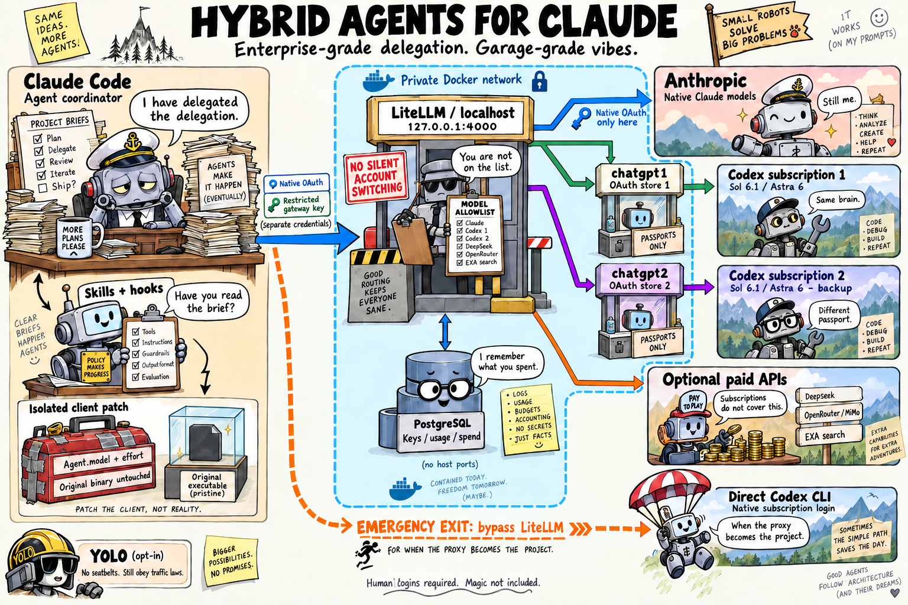
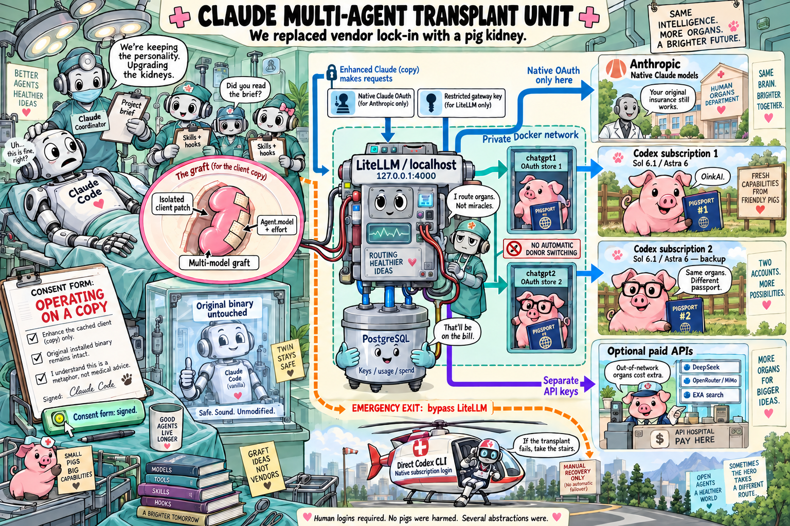

# Architecture, with malpractice insurance

Two illustrated views of the same system. The [technical architecture](../../ARCHITECTURE.md)
and [operations guide](../../OPS.md) are authoritative; these are visual metaphors,
not exact request-envelope diagrams or medical advice.

## Command center

Enterprise-grade delegation. Garage-grade vibes.

## Transplant unit

We replaced vendor lock-in with a pig kidney.

Generated with the built-in image-generation tool, then visually reviewed and
edited to clarify the worker network boundary and native/paid routing. Both
posters preserve the core constraints: original client untouched, independent
OAuth stores, no silent account switching, and explicit direct-Codex recovery.

The final prompt sets, including targeted edits, are recorded in
[architecture-prompt.txt](architecture-prompt.txt) and
[architecture-surgery-prompt.txt](architecture-surgery-prompt.txt).
No credentials, account identifiers or private deployment details are included.
